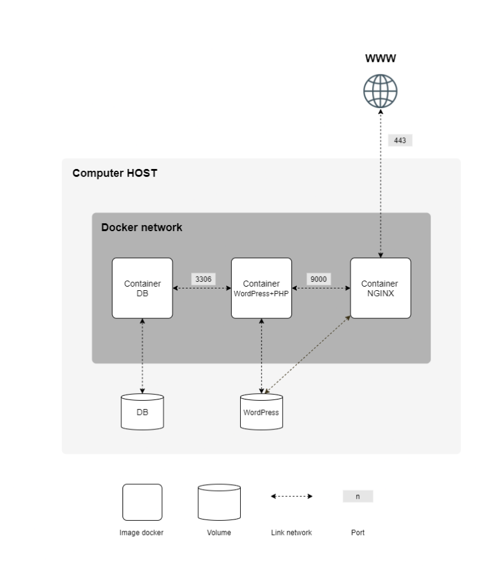

## ***This project has been created as part of the 42 curriculum by [sboukiou](https://github.com/sboukiou)***

# 🐳 Inception - System Administration with Docker

## 📖 Description
### This project is about setting up a small infrastructure composed of three services:
* **A database server (MariaDB)**
* **A Website  (WordPress)**
* **A web server (Nginx)**

***As the project Subject States, This has to be done using Docker and Docker-Compose?***
**But What is docker ? And what is Docker compose??**
* ***If you have the time, I strongly recommend you check this book:*** **[The docker Book](https://github.com/AngelSanchezT/books-1/blob/master/docker/the-docker-book.pdf)**
* ***Otherwise, You can check the docker docs, articles online, courses ... Here are few:***
* ***[Docker Documentation](https://docs.docker.com/)***
* ***[How docker creates containers in depth](https://youtu.be/sK5i-N34im8?si=6t9CMJjiLEthWshA) (If you want a deep lookup under the hood)***

**You primarily need to have a basic understanding of :**
- building and running containers (ie: `docker build`, `docker run`, `docker ps`).
- How to write a `Dockerfile`.
- Have an idea about `volumes`, `networks` in the context of `Docker`.
- And you are ready to build you services, run and connect them.
- But running multi container applications and managing/tracking them manually is a time waste, and not efficient. How do we change that?
**Exactly: `Docker compse`**

## Instructions

### OK, Where do I begin??

First you need to know the `architecture/project-structure` of your `product`
Here is an example:
***
```
    .
├── secrets # Here is where you put your secrets, (ie. Passwords, or anything you may want to keep safe/hidden)
└── srcs # this is where all your configurations/setups are going to live in.
    └── requirements # This is where you put each of the services
        ├── service1  
        │   ├── config  # For each service, you may have a directory for config files (ie: nginx.conf, www.conf, 50-server.cnf ...)
        │   └── tools   # and a tools dir for the scripts that you uses for each service.
        │   └── Dockerfile  # A Dockerfile is obviously required for each service 
        ├── service2
        │   ├── config
        │   └── tools
        │   └── Dockerfile
        └── service3
            ├── config
            └── tools
        │   └── Dockerfile
        # For bonus services, its quite the same, just add the services with the same structure under srcs/requirements/bonus directory.


```
***


**Now that you have the template, we have to fill it.**

***We take a look at our subject diagram***


**Its basically saying we need to have the three service mentioned eariler + some adjustments:**
* ***They have to be connected using a docker network, meaning we have to set a virtual-switch like network that isolates the containers from
the outside. so they are only accessible from within the private network***

* ****MariaDB server Would accept incoming trafic through port 3306, from any host as long as they are inside the PN.***
* ***WordPress container would be accessible through Port 9000 the same way..***
* ***Nginx is the only exception, in which we will have to expose the 443 port and make reachable beyong the private docker network. Meaning its accessible from the outside
and serves as our application entry point***
* ***Two volumes will be added: One for the Database, and one for our wordpress website.***

    
